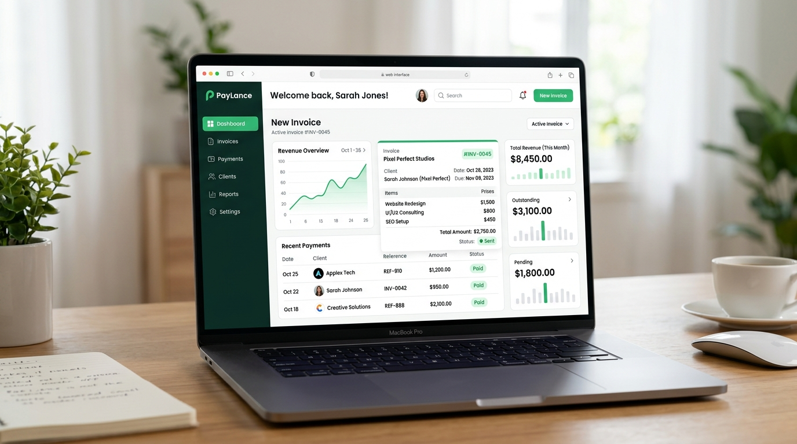

# Freelancer Billing Hub

## Purpose
Billing and invoicing system for freelancers.

## Tech Stack
Next.js frontend, Node backend, Stripe integration, Postgres DB.

## How to Run Locally
1. Install dependencies: npm install
2. Set environment variables (see .env.example)
3. Run dev server: npm run dev

## Architecture
Microservices architecture.

## UI Mockup

