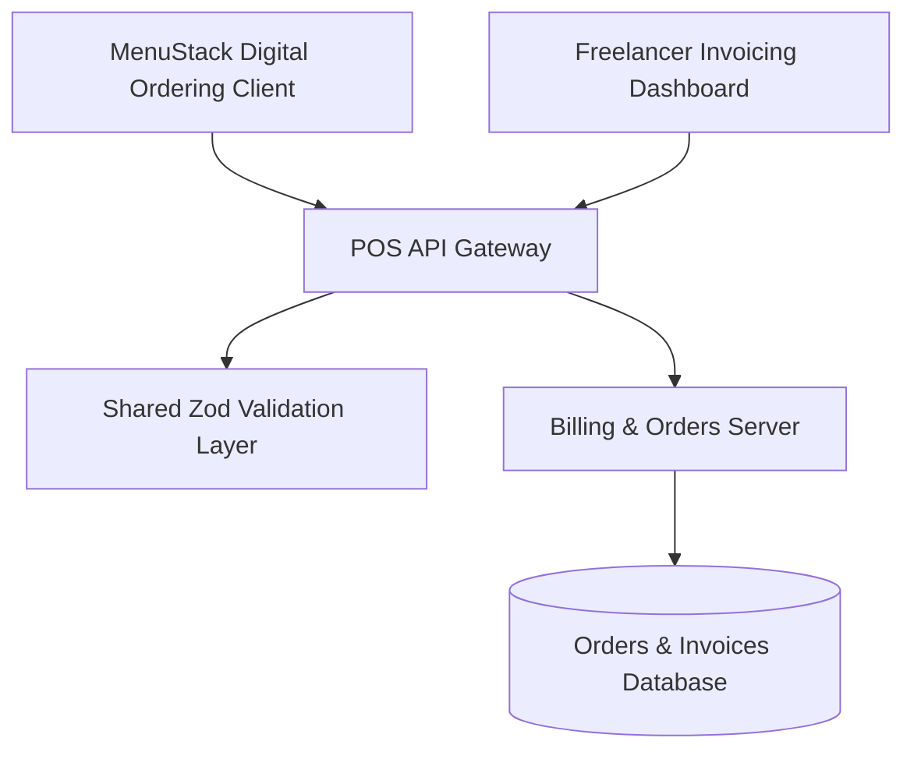

# MenuStack & Freelancer Billing Hub Monorepo

Enterprise digital menu ordering, invoice tracking, and point-of-sale billing monorepo combining MenuStack with automated client accounting pipelines.



## System Modules

- **`artifacts/menustack/`**: Digital interactive menu application with real-time item customization, cart tracking, and QR table ordering flows.
- **`artifacts/api-server/`**: Financial transaction and invoice processing service enforcing idempotent payment generation.
- **`lib/api-zod/`**: Input validation boundaries for item catalogs, discount calculations, and invoice records.
- **`lib/api-client-react/`**: Unified API communication layer shared across customer menus and merchant backends.
- **`lib/db/`**: Relational persistence schemas with transactional ACID boundaries for order settlement.

## Technology Stack

- **Monorepo Manager**: pnpm workspaces
- **Frontend Applications**: React 18, Vite, Tailwind CSS, TypeScript
- **Backend APIs**: Node.js, Express, TypeScript, Zod
- **Infrastructure**: Docker Compose, Nginx ingress

## Getting Started

```bash
# Install dependencies
pnpm install

# Start all applications in watch mode
pnpm run dev
```
